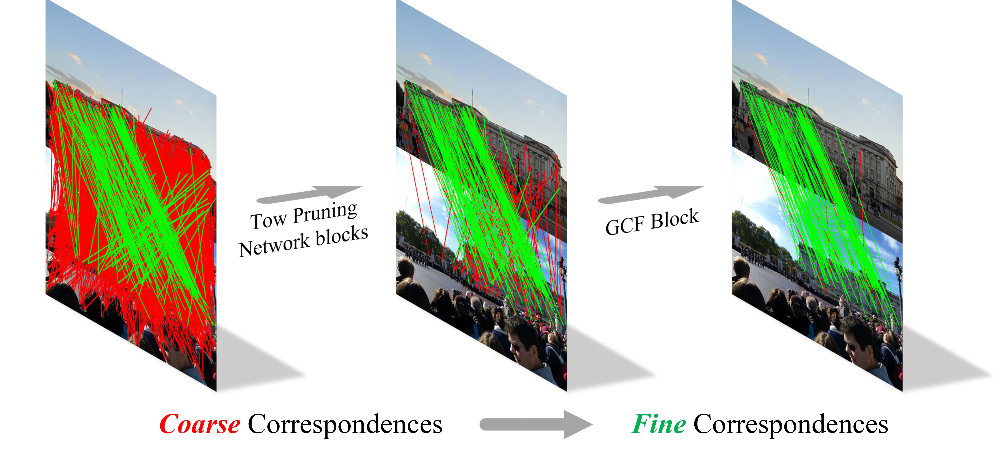

# SGA-Net: A Sparse Graph Attention Network for Two-View Correspondence Learning

Official implementation of [SGA-Net: A Sparse Graph Attention Network for Two-View Correspondence Learning](https://ieeexplore.ieee.org/document/10124002). 

The paper has been accepted by TCSVT 2023. 

## Introduction
SGA-Net is able to capture rich contextual information of sparse graphs for feature matching task. 
Specifically, a graph attention block is proposed to enhance the representational ability of graph-structured features. 
Meanwhile, a sparse graph transformer is developed to capture rich structural information of sparse graphs and greatly slash time and memory consumption. 
Additionally, a simple graph-context fusion block is introduced to adaptively capture topological information from different layers by implicitly modeling the interdependence between these graph contexts. 

<div align=center></div>

## Requirements

### Installation
We recommend using Anaconda or Miniconda. To setup the environment, follow the instructions below. 
```bash
conda create -n sganet python=3.8 --yes
conda activate sganet
conda install pytorch==1.7.1 torchvision==0.8.2 cudatoolkit=11.0 -c pytorch --yes
python -m pip install -r requirements.txt
```

### Dataset
Follow the instructions provided [here](https://github.com/CARRLIANSS/early_learning/blob/main/OANet/README.md) for downloading and preprocessing datasets. 
The packaged dataset should be put in the `data/` and directory structure should be: 
```
$SGA-Net
    |----data
      |----yfcc-sift-2000-train.hdf5
      |----yfcc-sift-2000-val.hdf5
      |----yfcc-sift-2000-test.hdf5
      ...
```

## Training & Evaluation
1. If you have multiple gpus, it is recommended to use `train_multi_gpu.py` for training. `train_single_gpu.py` is recommended for debugging.
```
# train by multi gpu
CUDA_VISIBLE_DEVICES=0,1,2,3 nohup python -u -m torch.distributed.launch --nproc_per_node=4 --use_env train_multi_gpu.py >./logs/sganet_yfcc.txt 2>&1 &

# train by single gpu
nohup python -u train_single_gpu.py >./logs/sganet_yfcc.txt 2>&1 &
```

2. Evaluation
```
python test.py
```

## How to use demo?
1. If your two images have camera pose ground truth and intrinsics, it is recommended to run `demo_withGT.py` script. The true matches and false matches of the visualization results are based on the epipolar distance (< 1e-4). [Here](https://drive.google.com/file/d/1CM1SMD6P-eVfk9z-Bnz7HrB0CeGJSSfj/view?usp=drive_link), we provide a scene of YFCC100M with ground truth. The scene should be put in the `assets/` and directory structure should be:
```
$SGA-Net
    |----assets
      |----sacre_coeur
          |----test
              |----calibration
              |----images
              |----visibility
              ...
```


## Acknowlegment
This repo benefits from [OANet](https://github.com/zjhthu/OANet) and [CLNet](https://github.com/sailor-z/CLNet). Thanks for their wonderful works. 

## Citation
Thanks for citing our paper:

```
@article{liao2023sga,
  title={SGA-Net: A Sparse Graph Attention Network for Two-View Correspondence Learning},
  author={Liao, Tangfei and Zhang, Xiaoqin and Xu, Yuewang and Shi, Ziwei and Xiao, Guobao},
  journal={IEEE Transactions on Circuits and Systems for Video Technology},
  year={2023},
  publisher={IEEE}
}
```
